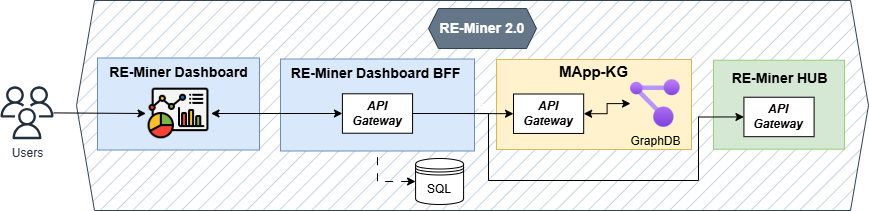

# RE-Miner Dashboard

The **RE-Miner Dashboard** is a core component of **RE-Miner 2.0**, part of the broader **RE-Miner Ecosystem**. 

It provides an intuitive UI for users to interact with the RE-Miner 2.0 backend for data analysis, visualization, and NLP-based insights.

## RE-Miner 2.0 Architecture

The structure of **RE-Miner 2.0** is illustrated in the diagram below:




💡 **Key Note:** While the dashboard enhances usability, it is **not strictly required**—users can interact directly with the backend via its API.

---

## ✨ Key Features

✅ **Web-based UI** – Easy-to-use interface for interacting with RE-Miner 2.0.  
✅ **Seamless API Communication** – Connects with the backend effortlessly.  
✅ **Data Visualization** – Graphs, charts, and analytics for enhanced insights.  
✅ **Extensibility** – Built to integrate future RE-Miner ecosystem expansions.

---

## 📸 Screenshots & Demo

Here are some visuals showcasing the RE-Miner Dashboard:

### 🔹 Main Dashboard View


### 🔹 Review Analyzer


### 🔹 Batch Review Analytics (GIF Demo)


### 🔹 Feature Clustering (GIF Demo)


### 🎥 Video Demo
A full demo is available on [YouTube](https://www.youtube.com/watch?v=a11bHSCYqqM).

---
## 🛠 Dependencies
The frontend requires the following dependencies to function properly:

- 🔗 **[RE-Miner Dashboard BFF (Backend for Frontend)](https://github.com/gessi-chatbots/RE-Miner-Dashboard-BFF)** – An intermediary layer for API communication.
- 🔗 **[MApp-KG](https://github.com/gessi-chatbots/app_data_repository)** – An RDF-based knowledge graph that integrates a catalog of mobile applications and user reviews.
- 🔗 **[RE-Miner HUB](https://github.com/gessi-chatbots/RE-Miner-Hub)** – The central integration point connecting the core layer with the outer layers. It facilitates communication within the RE-Miner 2.0 ecosystem and is essential for performing all RE-Miner 2.0 tasks.
- **SQL Database** – Stores structured data (e.g., user information).

⚠ **Note:** To install all dependencies at once, you can use the **[RE-Miner Orchestrator](https://github.com/gessi-chatbots/RE-Miner-Orchestrator)**.

---

## 📦 How to Install

### Frontend Setup (React)

1. Clone the repository:
```bash
git clone https://github.com/gessi-chatbots/RE-Miner-Dashboard
cd RE-Miner-Dashboard
```
2. Install dependencies:
```bash
npm install
```
3. Start the development server:
```bash
npm start --port=8000
```
---

## 🚀 How to Deploy

### Deploying Frontend
#### Manually
1. Build the production version:
```bash
npm run build
```
2. Serve the app (example using `serve`):
```bash
serve -s build
```
#### Docker
1. Build the Docker image:
```bash
docker build -t re-miner-dashboard .
```
2. Run the container:
```bash
docker run -d -p 8000:8000 re-miner-dashboard
```

## 📜 License

This project is licensed under the **[GNU General Public License v3.0](https://www.gnu.org/licenses/gpl-3.0.html)**.  
For more details, see the [`LICENSE`](LICENSE) file.

---

🔗 **Developed by [GESSI - NLP4SE](https://gessi.upc.edu/en/research-areas/nlp4se)**  
